# Design Patterns

## Strategy Pattern:
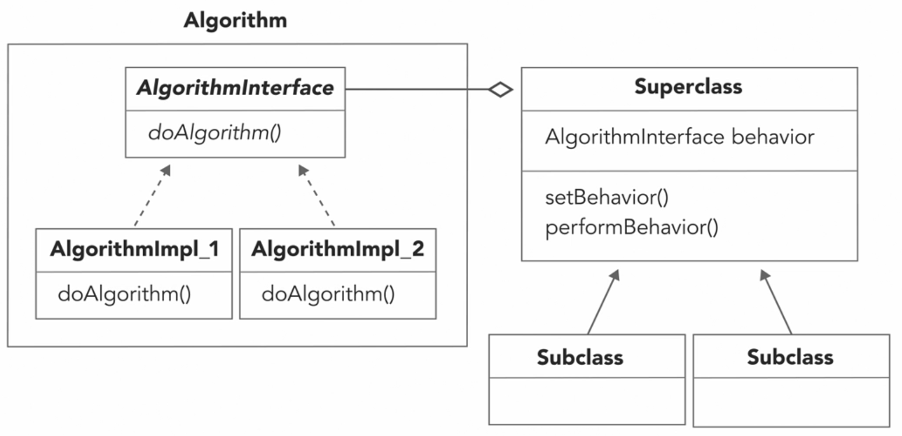
The first example will be using Interfaces where each class will have to implement its own methods:

### InterfaceExample:
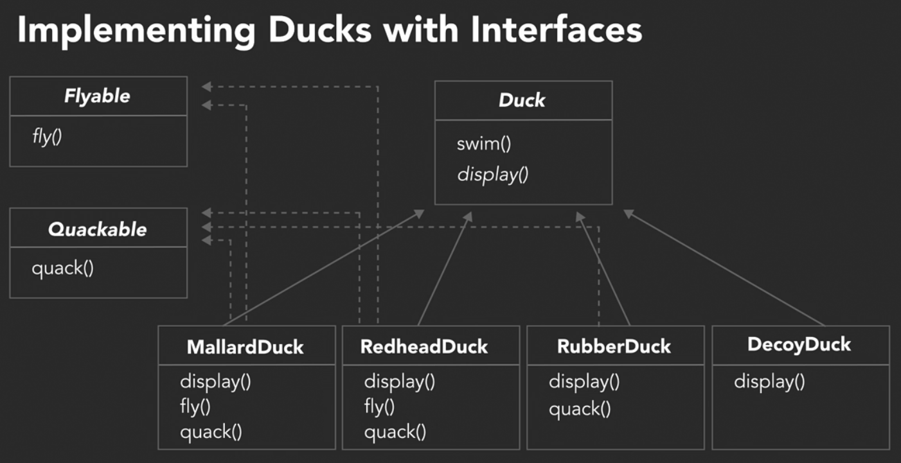

### BehaviorInterfaceExample:
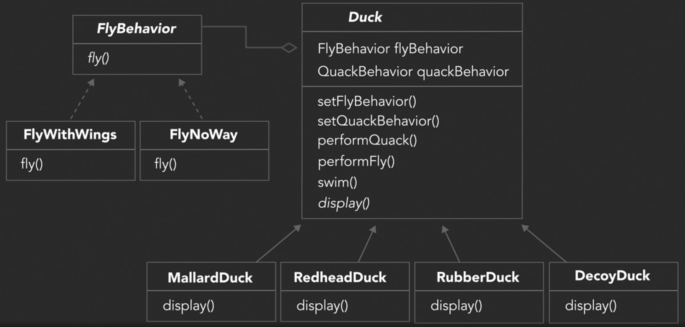

## Adapter Pattern:
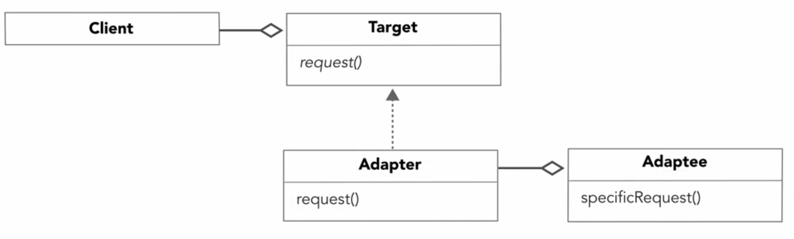

### DuckExample
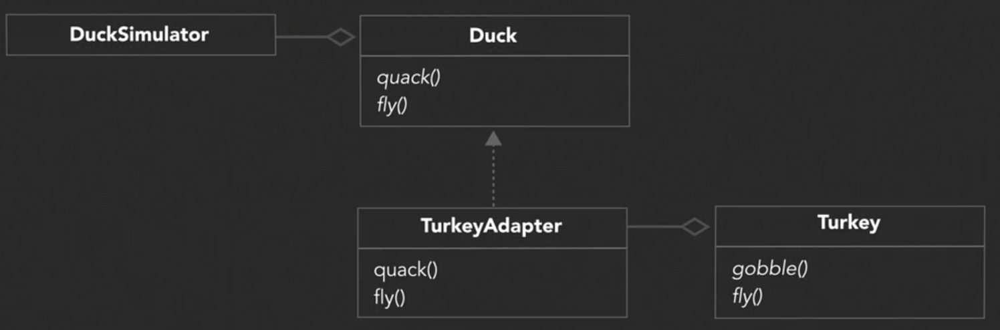

## Observer Pattern:
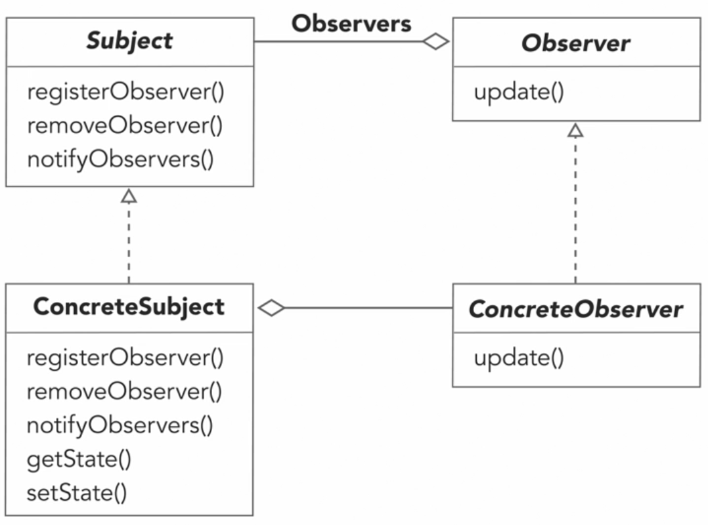

### WeatherExample
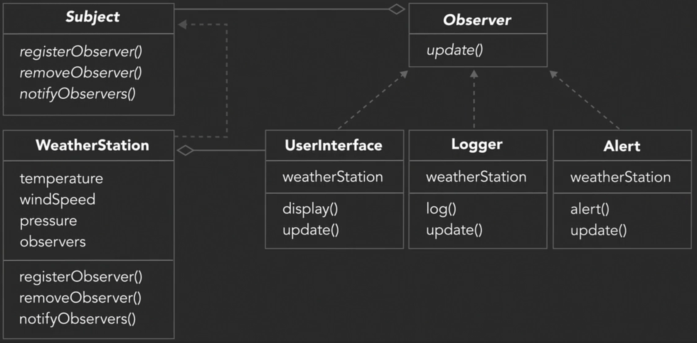

## Decorator Pattern:
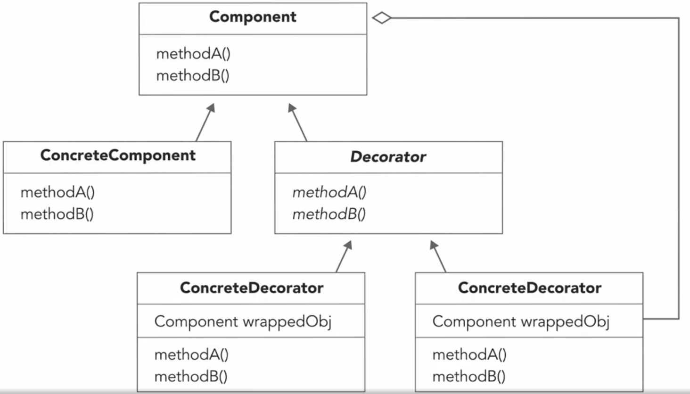

### CoffeeShopExample
Initial Design:
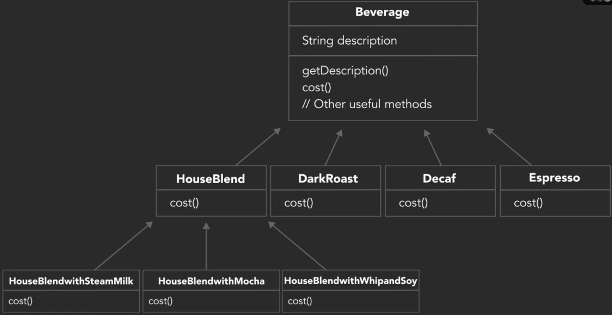

Improved Design: Still a problem since the customer can ask for adding more condiments to the beverage and becomes difficult to calculate the cost
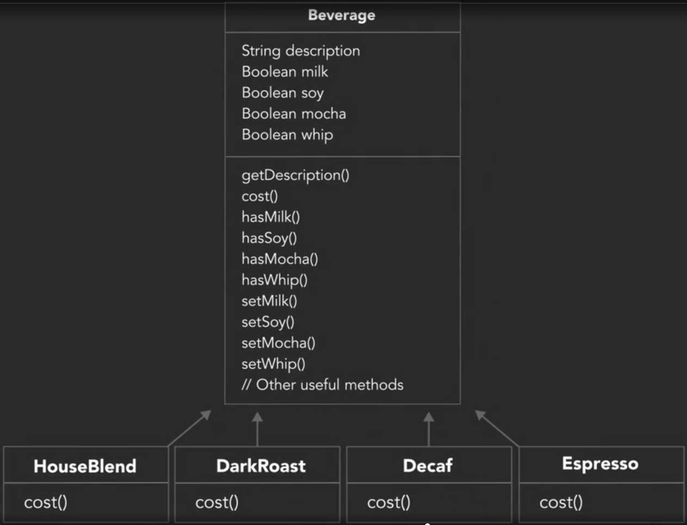

Applying Decorator Pattern:
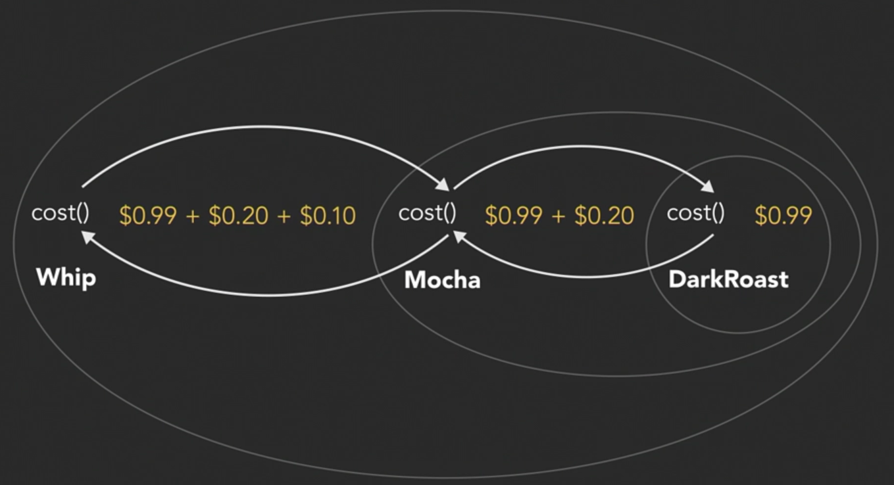
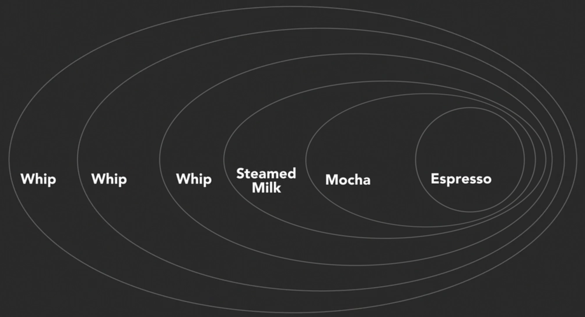

### CoffeeShopExample
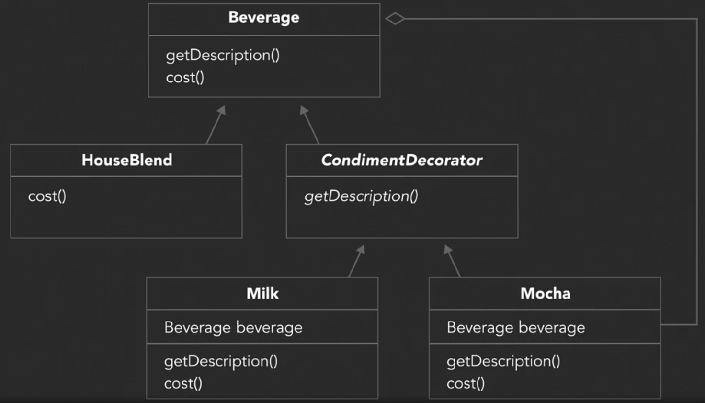
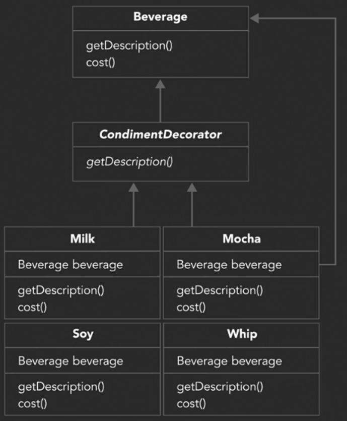

### PizzaShopExample
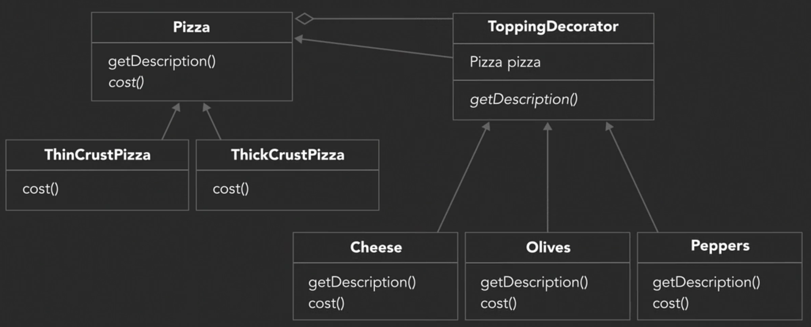

## Iterator Pattern
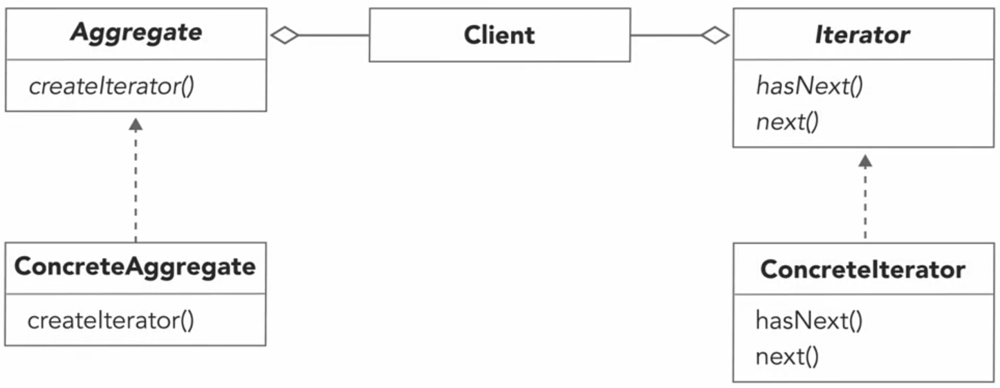

### CafeExample
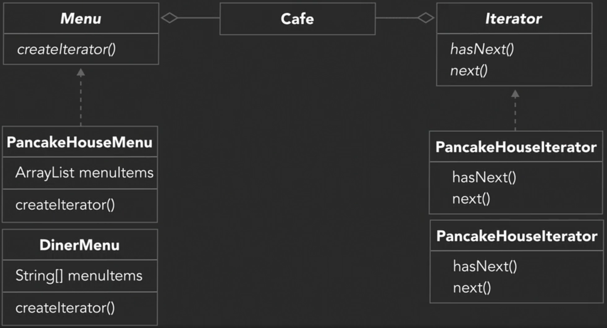